# Connect 4

John Alacce
18-224 Spring 2024 Final Tapeout Project

## Overview

This project plays connect 4 in PVP mode or a PVE mode with the game output to a VGA display.

## How it Works

The VGA module was taken from https://github.com/asinghani/ulx3s-vga-example

The Board module takes in the current row and column and determines if that pixel should be a board pixel.
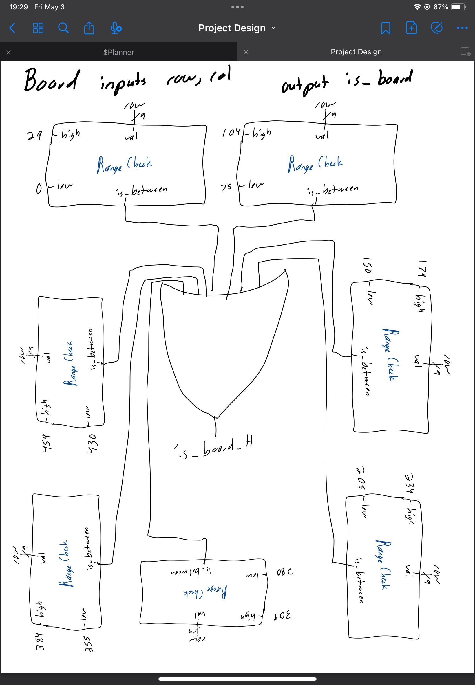
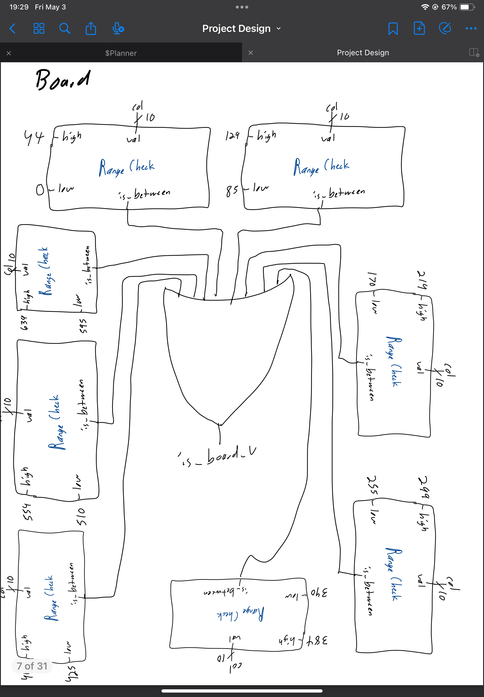
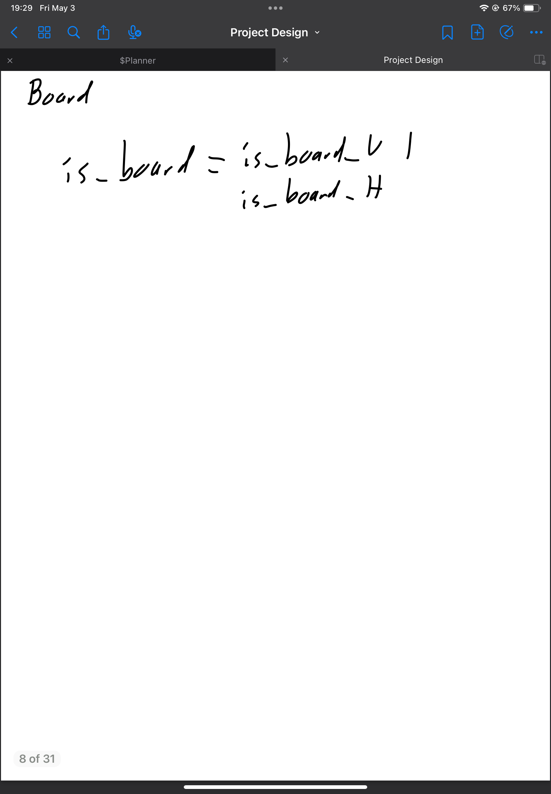

The Token module takes in the current row and column and determines if that pixel should be a token pixel. This module also tells the color module which token the current row/col corresponds to.
Shown here is a sample of how 7 of the tokens work with the full documenation in the Design directory.
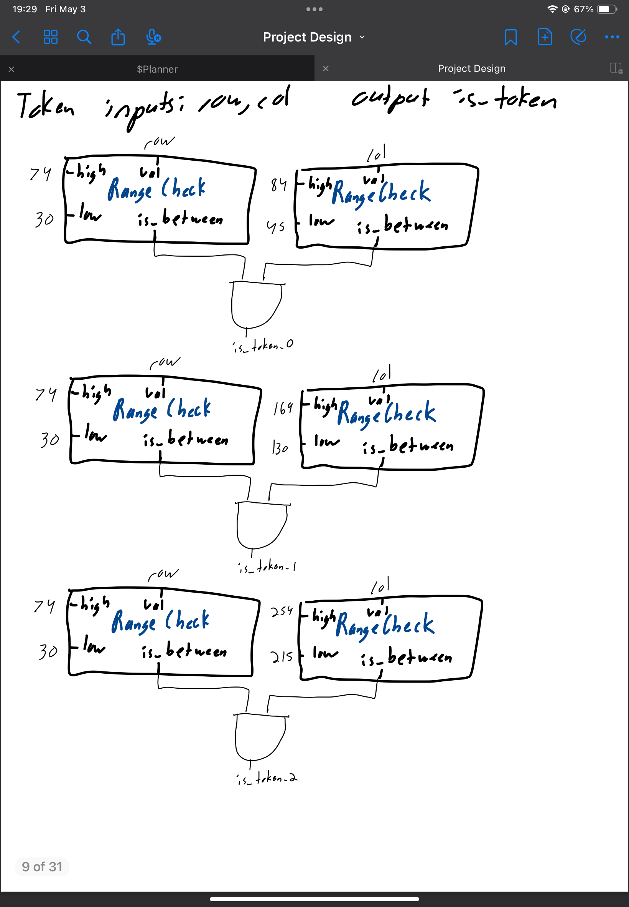
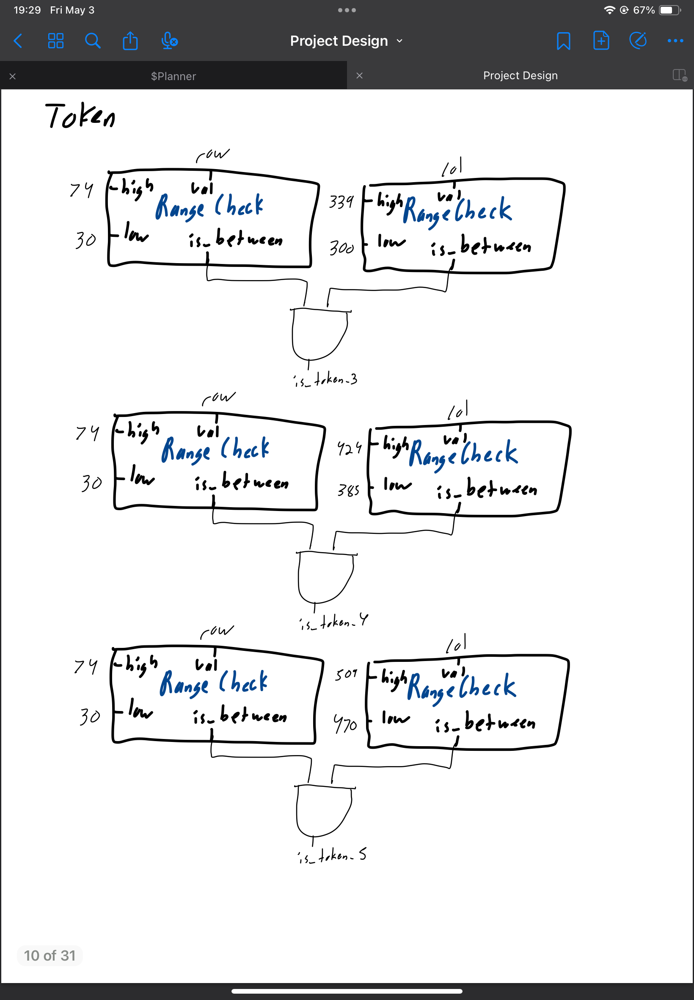
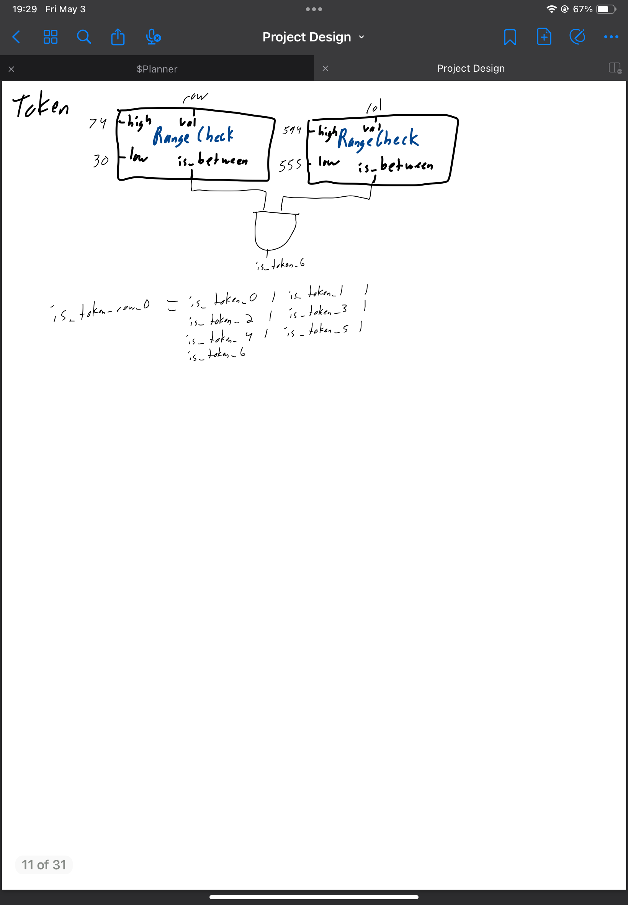

The Ownership module takes in the players input along with which player it is. It then finds the lowest valid row for the token to be changes and changes the value in the packed/unpacked array to be of the current player.
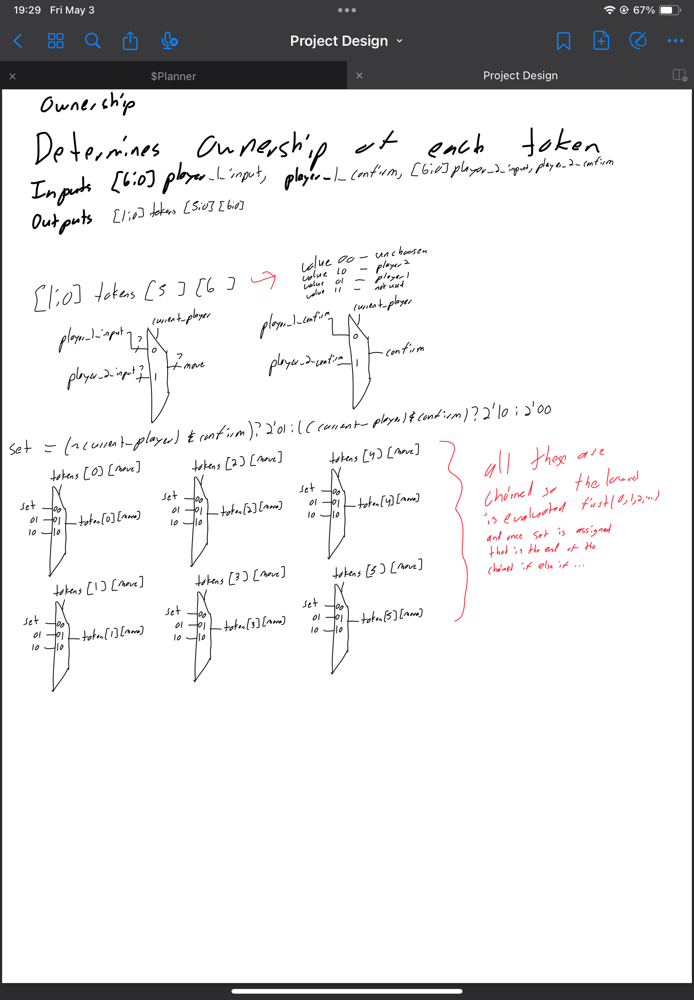

The PVE module uses LSFR modules to randomly create possible moves and then the innermost move out of the possible moves is taken.
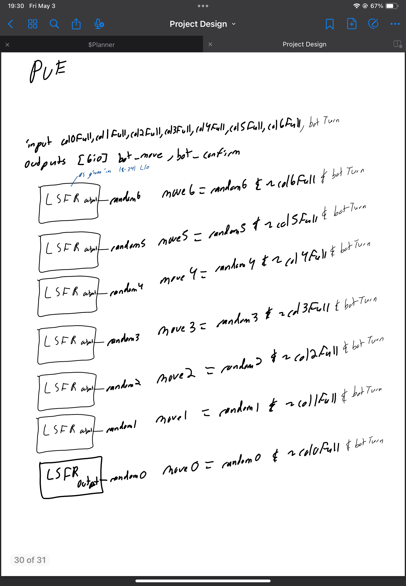
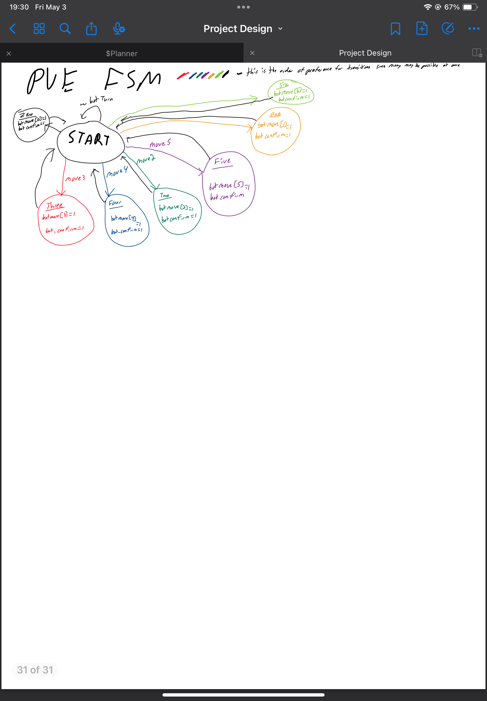

The Colors module determines what RGB value the current pixel as determined by the row/col should be using information from the Board module, Token module and the Ownership module.
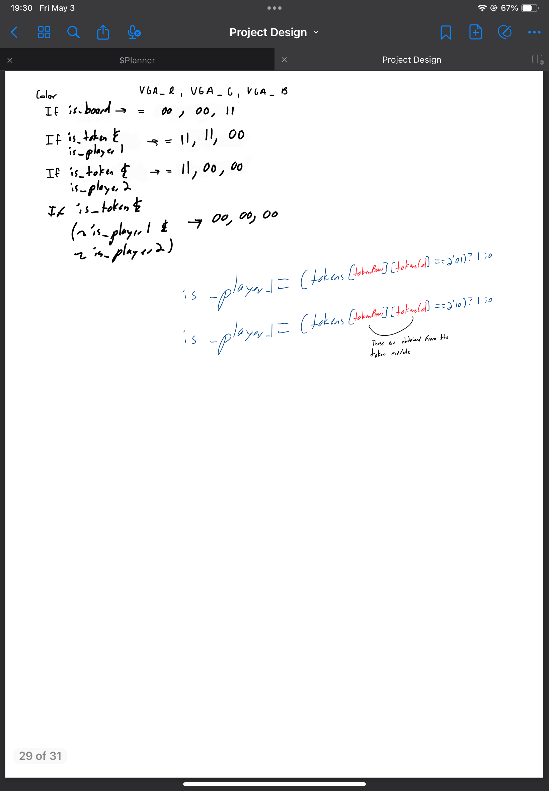

## Inputs/Outputs
Input Pins
0-6: Allows the human player to select between the 7 available columns to place
their next token
7: Allows the human player to confirm the selected column
8: Switch between player 1 and player 2 turn: High is Player 2 Low is Player 1 
9: Switch between PvP and PvE mode: High is PVP Low is PVE
10: Start New Game
Output Pins
0: VGA Vertical Sync
1: VGA Horizontal Sync
2: VGA Blank
3: VGA VGA Clock
4-5: VGA Red
6-7: VGA Green
8-9: VGA Blue

A 25Mhz clock must be used for the VGA display logic to meat the timing conditions of VGA.

## Hardware Peripherals

A VGA display is needed to display the game and takes all of the outputs.
Inputs 0-6,7,10 should be buttons.
Inputs 8,9 should be switches.

## Design Testing / Bringup

When started, reset, or the new Game input is pressed the display should look like this.
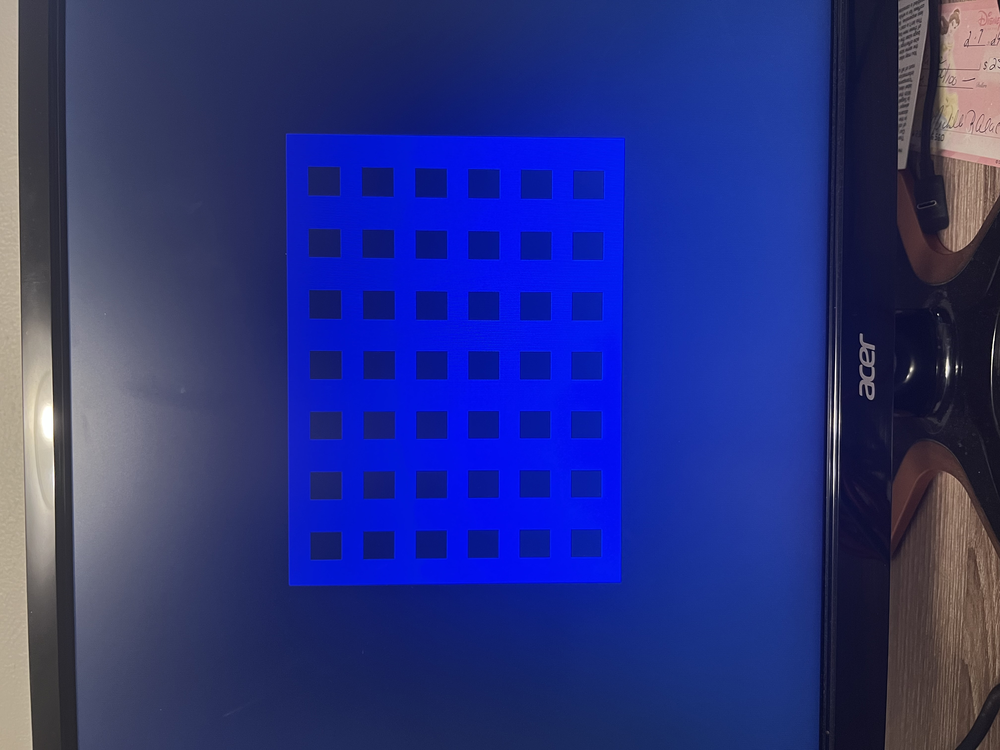

Valid player moves are one hot of the 0-6 inputs. The currently pressed move is taken when Player confirm is asserted. Player 1 moves should change the selected token in the lowest valid row red while Player 2 moves should change the selected token in the lowest valid row yellow.
All unselected tokens should be black. The PVE player should choose one token every time the current player switch is toggled to player 2 position.

## Media

A video of PVE mode is in pve.mp4

A video of PVP mode is in pvp.mp4

The files are to large(~25MB) for github to embed.

## FPGA use

Since yosys doesn't handle packed/unpacked arrays properly Sv2v was used to allow yosys to synthesis the project. The source SystemVerilog files are in src/systemVerilog. Also included is the verilog that was used to test on FPGA that is included in the FPGA directory.
The ULX3S is expecting buttons on the bottom layer of the header and should look like below. The down button is New Game. The button near the dipswitches is reset. The GPIO buttons are the move. The button closest to the GPIO buttons is confirm.
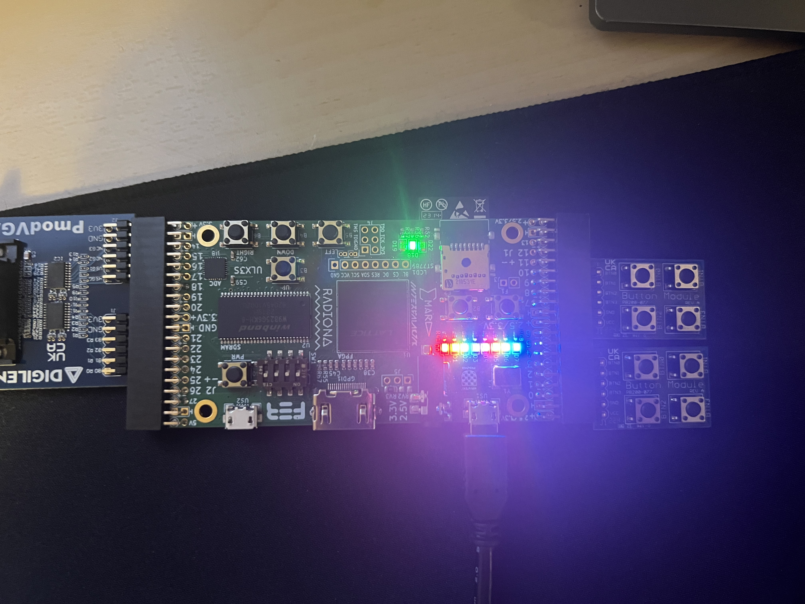

## CocoTB tests

The testbenches required the disconnect of the VGA module so Sv2v was used along with commenting out the connection of VGA along with disabling the timers in PVE and Top. The converted verilog along with the testbench and make file are in the Testbench directory.
